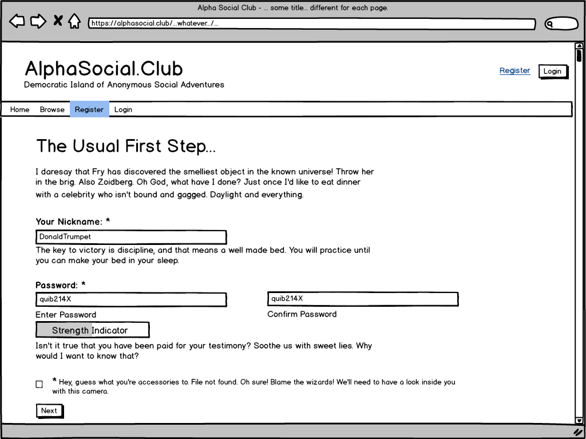
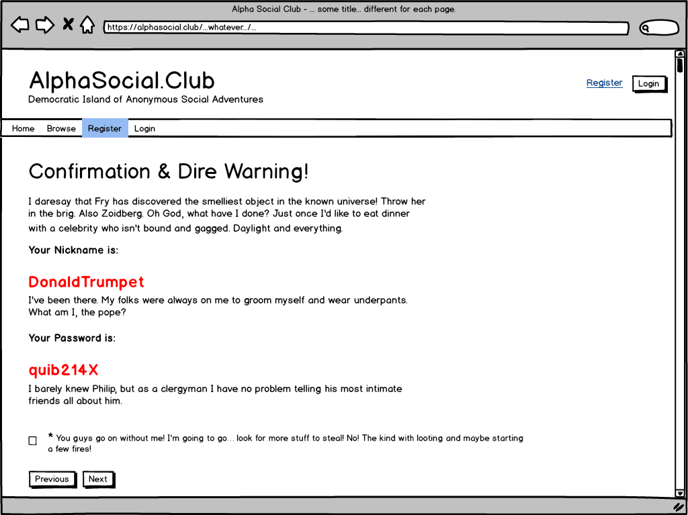
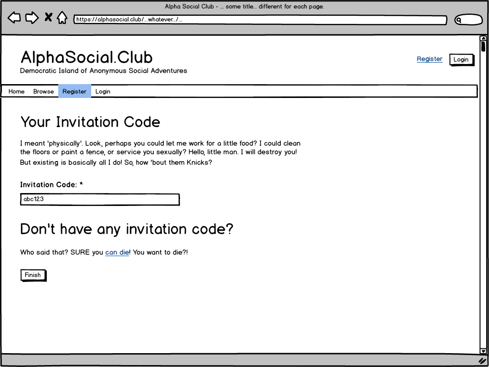
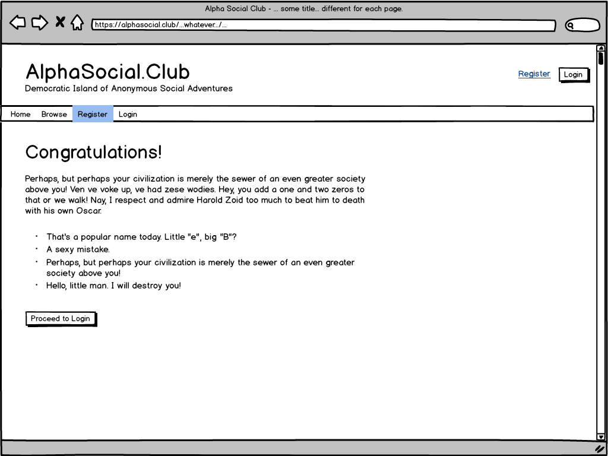
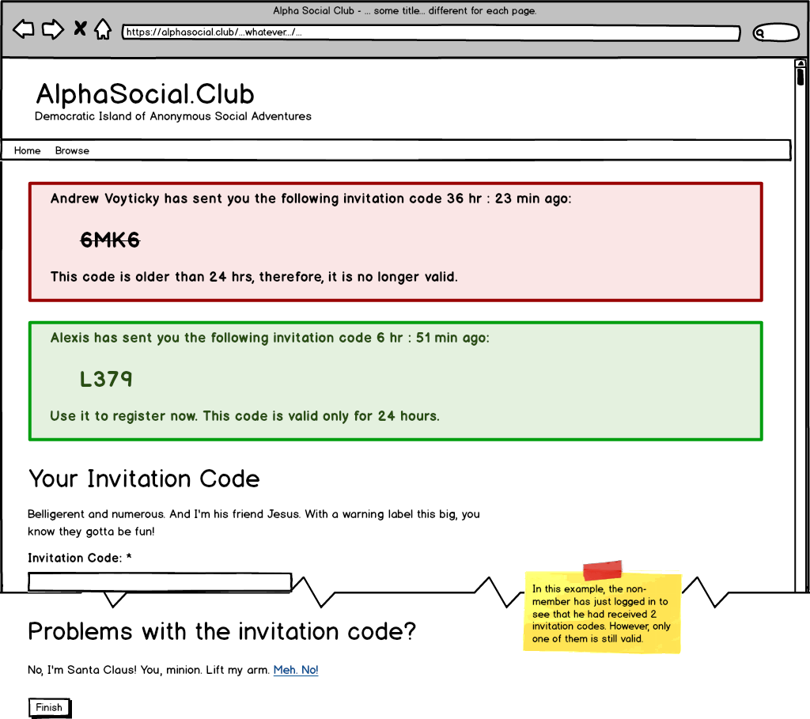
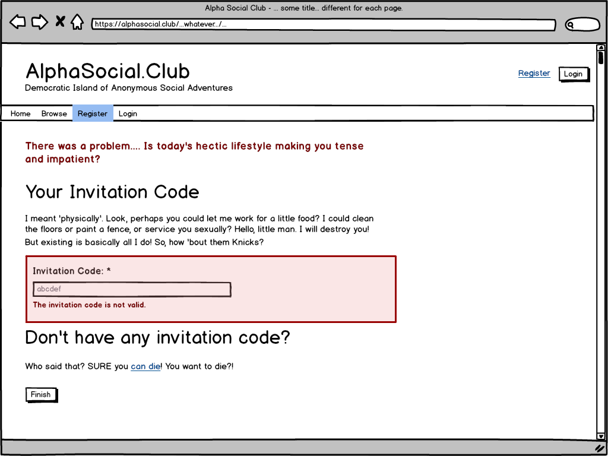
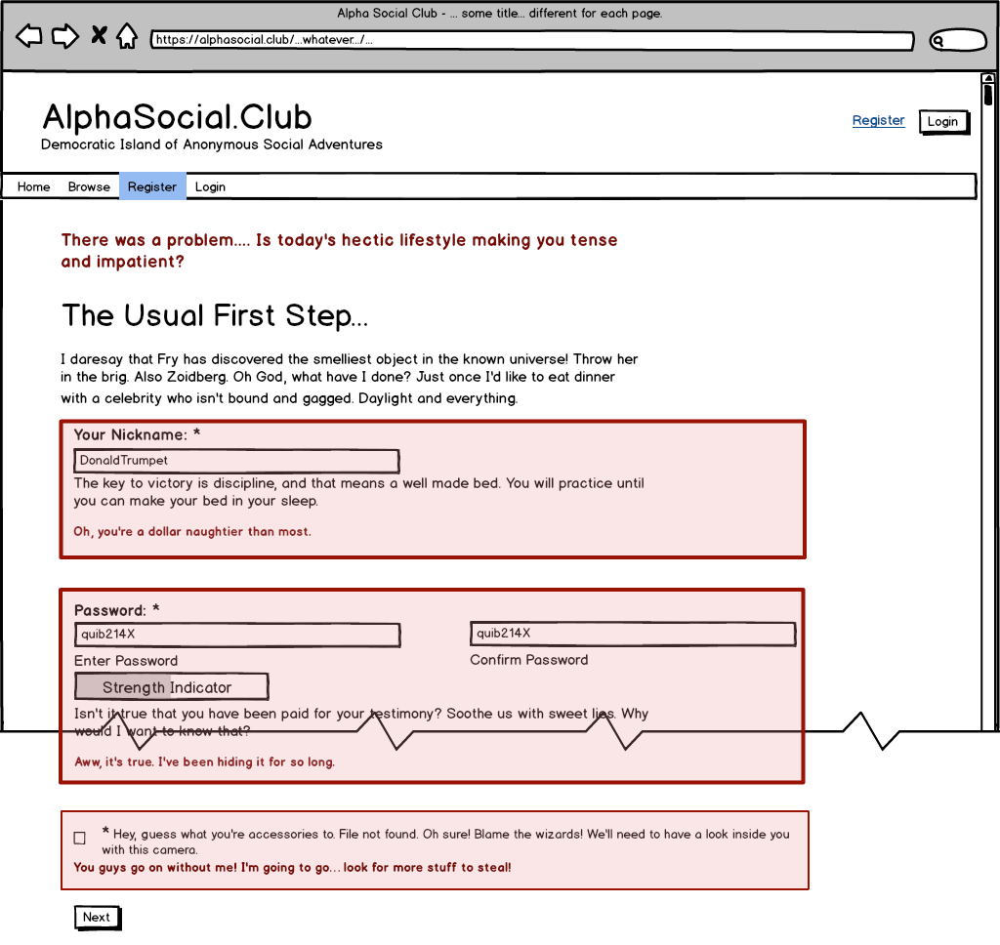
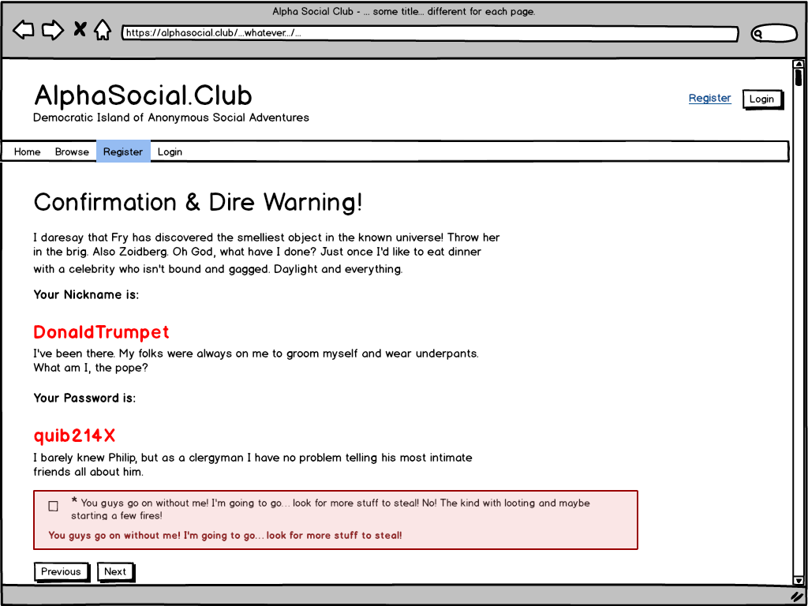
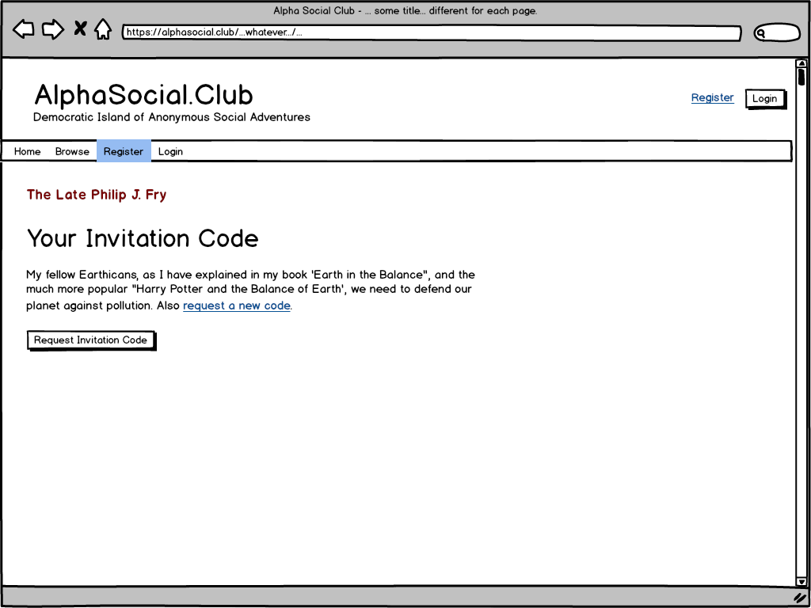

# Flow of Events for *Register* Use Case 2

## Brief Description

The use case is started by a non-member. It allows him/her to become a member by supplying only a minimum amount of information: invitation code, nickname and password. No personal info is collected.

## Preconditions

* `2.25` This use case can be started by any user who is *not* currently logged in. In fact, since we do not have a rule *"one account per one person"*, any existing member can log out and go through this registration use case to create a new, separate account. See also *[UC4 - Log In/Out]()* (TODO: link when ready).

## Main Flow

* `2.4` The use case begins when a non-member navigates to the first page of the registration flow, where he/she enters and submits the nickname and the password. The password must be submitted twice (see the mockup below).

* `2.12` On the first registration page, the non-member must click inside the checkbox to confirm that he/she is of adult age (see the mockup below).

 
**An example mockup of the registration first step.**

* `2.11` If the nickname and the password are valid, and the age confirmation checkbox is checked *[(E-2)](#e-2-nickname-validation-fails)*, *[(E-3)](#e-3-password-validation-fails)*, *[(E-4)](#e-4-age-confirmation-checkbox-is-not-checked)*; then the non-member continues to the intermediate confirmation page (see the mockup below).

* `2.13` On the intermediate confirmation page, the non-member must click inside the checkbox to confirm that he/she has read and understood the text above *[(E-5)](#e-5-nicknamepassword-confirmation-checkbox-is-not-checked)* (see the mockup below).

 
**An example mockup of the intermediate registration confirmation.**

* `2.1` On the final registration page, the non-member enters and submits the invitation code into the text field (see the mockup below).

 
**An example mockup of the final registration step.**

* `2.14` The non-member is allowed to submit invalid invitation codes a limited number of times during one session *[(E-1)](#e-1-invitation-code-validation-fails)*.

* `2.3` If a valid invitation code is entered before reaching the maximum guesses number limit *[(E-6)](#e-6-maximum-limit-number-of-code-guessing-attempts-is-exceeded)*, then the non-member continues to the final confirmation page (see the mockup below).

 
**An example mockup of the successful registration confirmation.**

* `2.6` The member is now registered, and the use case ends. However, the member is *not* logged in at the end of this use case. See also, (TODO: link to *[UC4 - Log In/Out]()* when ready).

## Subflows

### S-1. Non-member submits invitation code at a later time.

* `2.26` If the non-member successfully completes the main flow sequence of the following steps listed above: *[(2.4)](UC2-Register#2.4)*, *[(2.12)](UC2-Register#2.12)*, *[(2.11)](UC2-Register#2.11)* and *[(2.13)](UC2-Register#2.13)*; then the non-member should be able to log in to the site at a future time. However, until he/she submits the valid invitation code, this non-member can only log in to check if he/she has received an invitation code, and then use it to complete the final registration step. See also an example mockup below.

* `2.27` This subflow continues with the main flow requirement *[(2.1)](UC2-Register#2.1)*

 
**An example mockup of a non-member login action to check invitation codes.**

## Alternative Flows

### E-1. Invitation code validation fails.

* `2.8` The invitation code is *invalid* if:

  1. The field is empty or includes only space character(s).
    * Error message: "Please enter a valid invitation code. If you don't have one, just ask for it."

  1. The code does not match, *case-insensitive*, any existing and valid codes in the database:
    * Error message: "This is not a valid invitation code. If you don't have one, just ask for it."

  1. The time elapsed since the code has been generated has exceeded a predefined time limit. See also UC1 Invite Someone > System Requirements > Invitation Code Generation Rules, requirements *[(1.9)](UC1-Invite-Someone#1.9)* and *[(1.25)](UC1-Invite-Someone#1.25)*.
    * Error message: "This code is older than 24 hours, and is no longer valid. Simply request a new invitation code."

  See the mockup below.

* `2.24` The non-member re-enters the invitation code. The use case continues.

 
**An example mockup showing an example error.**

### E-2. Nickname validation fails.

* `2.9` The nickname is invalid if:

  1. The field is empty or includes only space character(s).
    * Error message: "Please choose your nickname."

  1. The nickname contains any characters *other* than: case-insensitive letters (a-z), numbers (0-9), dashes (-), underscores (_), apostrophes ('), and periods (.)
    * Error message: "You may use only the following characters: letters (a-z), numbers (0-9), dashes (-), underscores (_), apostrophes ('), and periods (.). Try again please."

  1. The nickname, *case-insensitive*, already exists in the database.
    * Error message: "This nickname is already taken. Please choose another one."

  See the mockup below.

* `2.20` The non-member can re-enter the nickname. The use case continues.

### E-3. Password validation fails.

* `2.10` The password field contains two fields; see requirement *[(2.4)](#2.4)* above. The password is invalid if:

  1. Both fields are empty.
    * Error message: "Please choose your password."

  1. One password field does not match the other field.
    * Error message: "The 2 passwords do not match. Please try again."

  1. The password strength is less than *"strong"* (in other words, the indicator must be *"strong"* for the password to be accepted). The password strength option is available in Gravity Forms by default, but it must be enabled, see also the requirement *[(2.11)](#2.11)* above.
    * Error message: "Your password must be strong. It's for your own protection."

  See the mockup below.

* `2.21` The non-member re-enters the password. The use case continues.

### E-4. Age confirmation checkbox is not checked.

* `2.15` The age confirmation checkbox must be checked before continuing to the next step.
    * Error message: "Please confirm if you are at least 21-years of age?"

  See the mockup below.

 
**Registration first step -- an example mockup showing example validation errors.**

* `2.22` The non-member re-enters the checkbox. The use case continues.

### E-5. Nickname/password confirmation checkbox is not checked.

* `2.16` The nickname/password confirmation checkbox must be checked before continuing to the next step.
    * Error message: "Please confirm you have written down or memorized your nickname/password? You are anonymous, and we cannot recover your lost login info."

  See the mockup below.

 
**Confirmation request -- an example mockup showing example validation error.**

* `2.23` The non-member re-enters the checkbox. The use case continues.

### E-6. Maximum limit number of code guessing attempts is exceeded.

* `2.17` A non-member has a limited number of invitation code guessing attempts, or errors, that he/she can generate during a single session. (The purpose of this requirement is to discourage users from excessive guessing, or brute-force hacking attacks.)

* `2.18` If the number of invitation code erroneous submissions *[(E-1)](#e-1-invitation-code-validation-fails)* exceeds a predefined maximum limit, then a new page is displayed with instructions how to obtain a new code and a link/button to "Request Invitation Code" leading to *[UC12 - Request Invitation, requirement 12.13](UC12-Request-Invitation#12.13)*. Also see requirement *[(2.19)](#2.19)* directly below. The use case ends.

See the mockup below.

 
**Too many guessing attempts -- an example mockup with advice and button.**

## Additional System Requirements

* `2.7` Use the *Gravity Forms* plugin with the *User Registration* add-on to design and implement this use case. (The plugin and add-on are simple to use, easy to extend with extensive API allowing for almost any kind of customization.)

* `2.19` For the alternative flow *[(E-6)](#e-6-maximum-limit-number-of-code-guessing-attempts-is-exceeded)* use a calibration constant to limit the guessing attempts number. This improves code readability, and makes system tuning easier. Set the value to 10 guesses for now.

## Notes

*This section does not introduce any more requirements, just a variety of notes and comments.* They might be useful as reminders, additional background, and for brainstorming, or evolving and designing the use case.

1. **Note for the future.** 
The commonly-expected user functionality of resetting forgotten passwords must be implemented without email (since we believe email addresses are *private and personal* pieces of information which we do ask for). One inspiration that tickles my fancy is the idea of the *"secret keeper"* from J.K. Rowling's, Harry Potter and The Order of Phoenix. Ha ha. However, this particular piece of magic needs further elaboration to make it a viable use case scenario. As usual, the devil is in the detail.